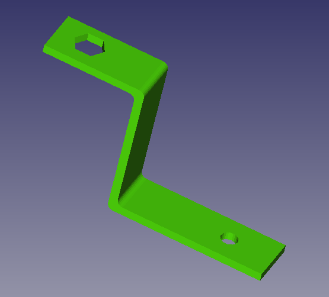

<h1>BOM (Bill of Materials, lista de materiales necesarios para los legos en english)</h1>
<h2>Piezas impresas en 3D</h2> 
<table>
  <tr><td>Base</td><td></td></tr>
  <tr><td>Segundo piso</td><td></td></tr>
  <tr><td>Separadores(pasatornillos) entre base y segundo piso (x6)</td><td></td></tr>
  <tr><td>Separadores (pasatornillos) para shield de Arduino y módulo L298 N (x8)</td><td></td></tr>
    <tr><td>Colocadores/fijadores de motores a base</td><td></td></tr>
  <tr><td>Soporte de sensor de ultrasonidos</td><td></td></tr>
  <tr><td>Soporte de sensor de infrarrojos FC51 (si tiras de sensores baratos)</td><td></td></tr>
  <tr><td>Soporte de sensor de infrarrojos TCRT5000 (si los prefieres a los FC51)</td><td></td></tr>
  </table>
  
  <h2>Electrónica</h2> 
<table>
  <tr><td colspan="2"><h3>Elementos imprescindibles</h3></td></tr>
  <tr> <td>Arduino nano con shield de expansión v3.0</td><td></td  </tr>
    <tr> <td>Micromotores DC modelo TT con reductora y rueda(x2)</td><td></td  </tr>
  <tr> <td>Módulo L298N para control de motores DC</td><td></td>  </tr>
  <tr> <td>Interruptor de 8 mm o similar</td><td></td>  </tr>
  <tr> <td>Portapilas 4xAA  (el portapilas 4xAAA también sirve) Soldar el interruptor al polo positivo del portapilas</td><td></td>  </tr>
      <tr><td colspan="2"><h3>Elementos opcionales</h3></tr>
  <tr> <td>Sensor de ultrasonidos HC-SR04</td><td></td>  </tr>
        <tr> <td>Sensor de infrarrojos TCRT 5000 (Primera opción)</td><td></td>  </tr>
        <tr> <td>Sensor de infrarrojos FC51 (Más barato, es el que utilizaremos en los tutoriales)</td><td></td>  </tr>
        <tr> <td>Módulo Bluetooth HC05 ó HC06 (En aquellos proyectos en que se utilicen, será MUY IMPORTANTE vigilar la velocidad a la que vamos a comunicarnos  con dicho módulo, 9600 ó 19200 baudios)</td><td></td>  </tr>

  </table>
  
  <h2>Otros</h2>
  <table>
  <tr><td>Rueda loca universal para coches, de nylon 23x15</td><td> </td></tr>
          <tr> <td>Tornillos y tuercas varios de tipo M3, de 12, 16 y 35 mm</td><td></td>  </tr>
  </table>
