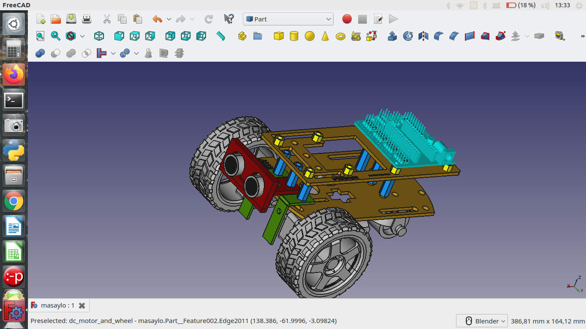
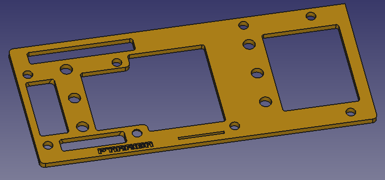
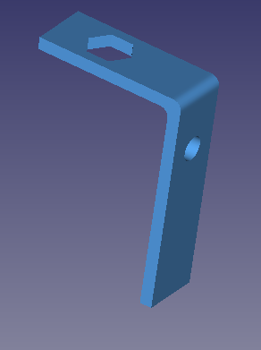
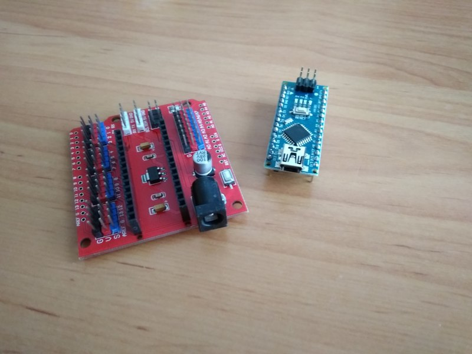
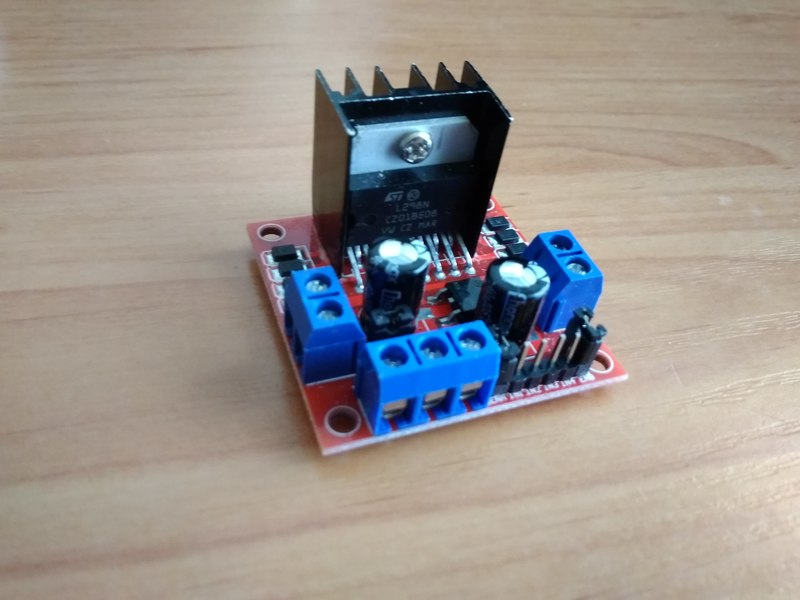
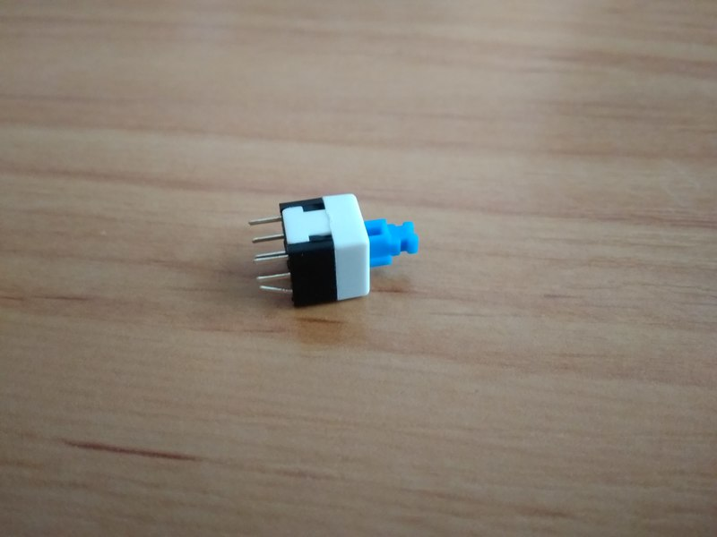
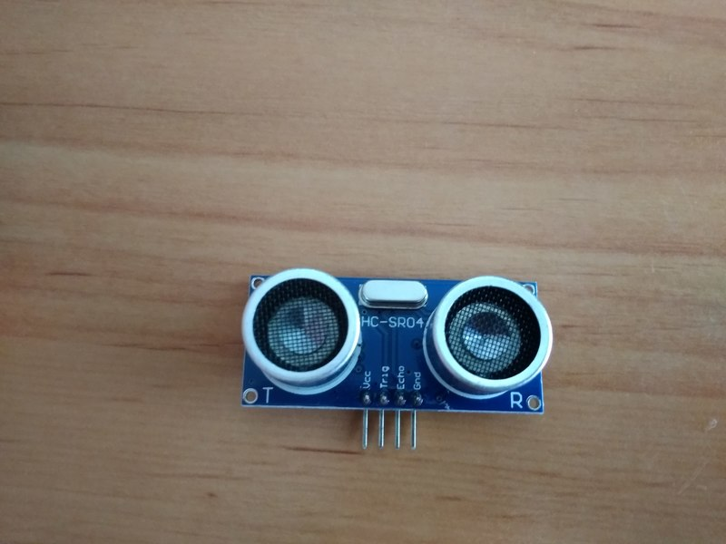

# Robot educativo Masaylo
Estoy intentando desarrollar un robot compatible con Arduino impreso en 3D, Masaylo, de tipo Low-Cost, propulsado por motores DC de los típicos que podemos encontrar en cualquier Aula-Taller de Tecnología.
A medida que progresemos intentaremos dotar al proyecto de una estructura algo más modular y coherente.

## Apariencia general

Utilizaremos: un Arduino nano con su correspondiente shield de expansión, un módulo L298N para gobernar dos motores DC, una rueda loca de 25x13 cm (o similar), un módulo sensor de ultrasonidos de tipo HC-SR04, dos sensores de infrarrojos de tipo FC-51 y un módulo BT modelo HC-05 o HC-06 que posiblemente habrá que tunear mediante comandos AT (o no; lo fundamental es saber a qué velocidad vamos a comunicarnos con él, y el código original espera que trabajemos a 19200 baudios; si es más cómodo para vosotros, podéis modificar el código para que trabaje a 9600 baudios).

## BOM (Bill of Materials; qué necesitamos)
Para empezar, aquí os dejo el [BOM generado por Fritzing](https://github.com/agomezgar/masaylo/blob/master/BOM.pdf)
<h2>Piezas impresas en 3D</h2> 
<table>
  <tr><td>Base</td><td></td></tr>
  <tr><td>Segundo piso</td><td></td></tr>
  <tr><td>Separadores(pasatornillos) entre base y segundo piso (x6)</td><td></td></tr>
  <tr><td>Separadores (pasatornillos) para shield de Arduino y módulo L298 N (x8)</td><td></td></tr>
    <tr><td>Colocadores/fijadores de motores a base</td><td></td></tr>
  <tr><td>Soporte de sensor de ultrasonidos</td><td></td></tr>
  <tr><td>Soporte de sensor de infrarrojos FC51 (si tiras de sensores baratos)</td><td></td></tr>
  <tr><td>Soporte de sensor de infrarrojos TCRT5000 (si los prefieres a los FC51)</td><td></td></tr>
  </table>
  
  <h2>Electrónica</h2> 
<table>
  <tr> <td>Arduino nano con shield de expansión v3.0</td><td></td  </tr>
    <tr> <td>Micromotores DC modelo TT con reductora y rueda(x2)</td><td></td  </tr>
  <tr> <td>Módulo L298N para control de motores DC</td><td></td>  </tr>
  <tr> <td>Interruptor de 8 mm o similar</td><td></td>  </tr>
  <tr> <td>Portapilas 4xAA  (el portapilas 4xAAA también sirve) Soldar el interruptor al polo positivo del portapilas</td><td></td>  </tr>
  <tr> <td>Sensor de ultrasonidos HC-SR04</td><td></td>  </tr>
        <tr> <td>Sensor de infrarrojos TCRT 5000 (Primera opción)</td><td></td>  </tr>
        <tr> <td>Sensor de infrarrojos FC51 (Más barato, es el que utilizaremos en los tutoriales)</td><td></td>  </tr>

  </table>
