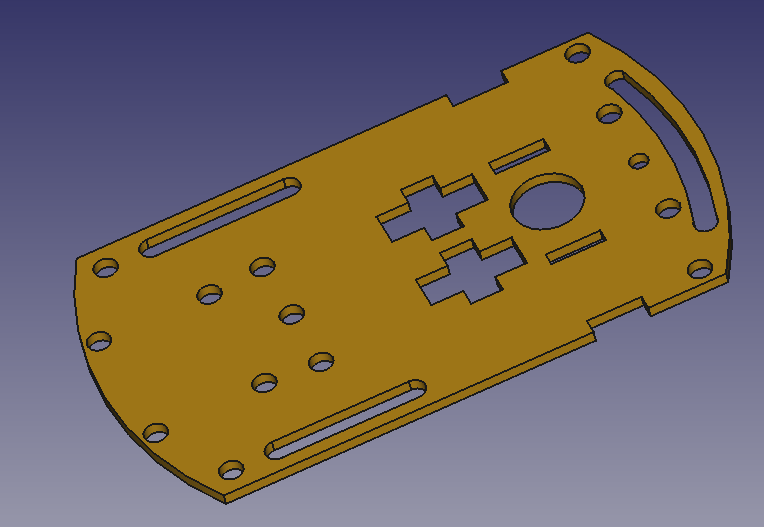
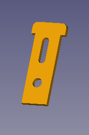
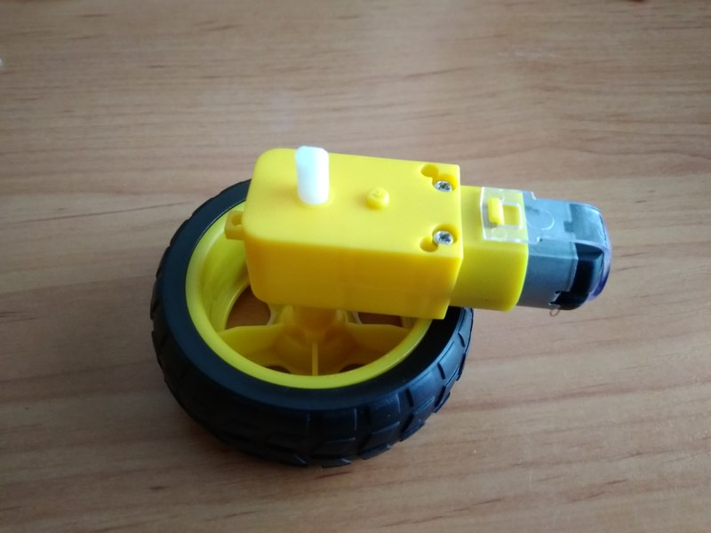

<h1>Instrucciones de montaje</h1>

¡Bueno!. ¿Ya has imprimido todas las piezas?. ¿Tienes la electrónica necesaria?. ¿Has acumulado toda la tornillería?. ¡Pues claro que no!. ¡Seguro que falta algo!. Murphy está siempre presente cuando hablamos de Robótica Educativa. De todos modos, no te preocupes. Léete las instrucciones, intenta seguirlas, y cuando algo no salga como estaba previsto, haz lo que hacemos siempre, ¡Improvisa!. ¡Vamos allá!

<h2> Fijar motores a la base</h2>
<h3>Piezas </h3>
<table>
  <tr><td>Base impresa en 3D</td><td></td></tr>
  <tr><td>Colocadores (x4)</td><td></td></tr>
    <tr><td>Motor DC modelo TT con motoreductora y rueda</td><td></td></tr>
      <tr><td>Rueda loca universal para coches</td><td></td></tr>

  <tr><td>4 tornillos M3x35 mm para atornillar los motores a la base</td></tr>

</table>
<h3>Proceso </h3>

a) Fijar motores a la base

