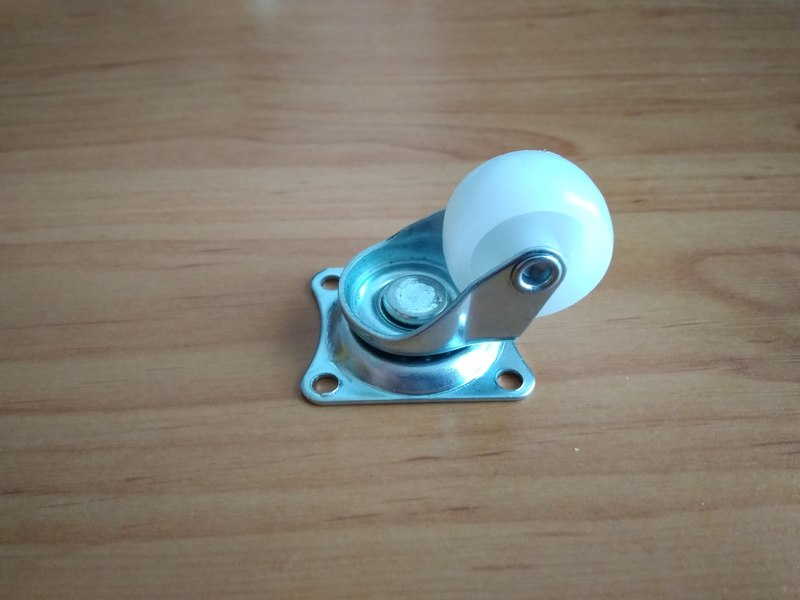
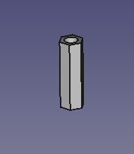
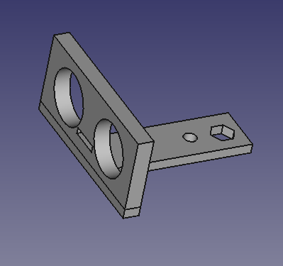

<h1>Instrucciones de montaje</h1>

¡Bueno!. ¿Ya has imprimido todas las piezas?. ¿Tienes la electrónica necesaria?. ¿Has acumulado toda la tornillería?. ¡Pues claro que no!. ¡Seguro que falta algo!. Murphy está siempre presente cuando hablamos de Robótica Educativa. De todos modos, no te preocupes. Léete las instrucciones, intenta seguirlas, y cuando algo no salga como estaba previsto, haz lo que hacemos siempre, ¡Improvisa!. ¡Vamos allá!

<h2> Fijar motores a la base</h2>
<h3>Piezas </h3>
<table>
  <tr><td>Base impresa en 3D</td><td></td></tr>
  <tr><td>Colocadores (x4)</td><td></td></tr>
  <tr><td>Separadores (pasatornillos) para rueda loca (x4) (la pieza en STL se llama "separaRueda(x4)"</td><td></td></tr>
    <tr><td>Motor DC modelo TT con motoreductora y rueda</td><td></td></tr>
      <tr><td>Rueda loca universal para coches</td><td></td></tr>

  <tr><td>4 tornillos M3x35 mm para atornillar los motores a la base</td></tr>
<tr><td>4 tornillos M3x16 mm para fijar la rueda loca a la base</td></tr>
<tr><td>8 tuercas M3</td></tr>

</table>
</table>
<h3>Proceso </h3>

a) Fijar motores a la base y atornillar

b) Fijar rueda loca a la base mediante tornillos M3x16 mm a través de los pasadores

<h2> Montar sensores y segundo piso</h2>
<h3>Piezas </h3>
<table>
  <tr><td>Separadores(pasatornillos) entre base y segundo piso(x6) (la pieza en STL se llama "SEPARADOR(x6)"</td><td></td></tr>
  <tr><td>Soporte para sensor de ultrasonidos </td><td></td></tr>
  <tr><td>Soporte para sensor IR (modelo FC-51 ó TCRT5000)(x2)</td><td></td></tr>
    <tr><td>Segundo piso del robot</td><td></td></tr>
      <tr><td>Sensor de ultrasonidos HC-SR04</td><td></td></tr>
  <tr><td>Sensor de infrarrojos (x2) </td><td></td></tr>

  <tr><td>6 tornillos M3x35 mm para fijar el segundo piso a la base</td></tr>
<tr><td>3 tornillos M3x12 mm para atornillar los sensores a sus soportes</td></tr>
<tr><td>9 tuercas M3</td></tr>

</table>
</table>
<h3>Proceso </h3>

a) Montar los sensores en sus soportes. Cada soporte estará atravesado por un separador y se prepararán para colocarlos en la parte delantera del robot

b) Atornillar la pieza llamada "Segundo Piso" a la base utilizando los seis separadores

<i><b>Nota: Al contrario que con la base, el segundo piso tiene orientación. Hay un pequeño serigrafiado, algo borroso, que pone: "P'ARRIBA". Imagínate para qué sirve. </b></i>
  

